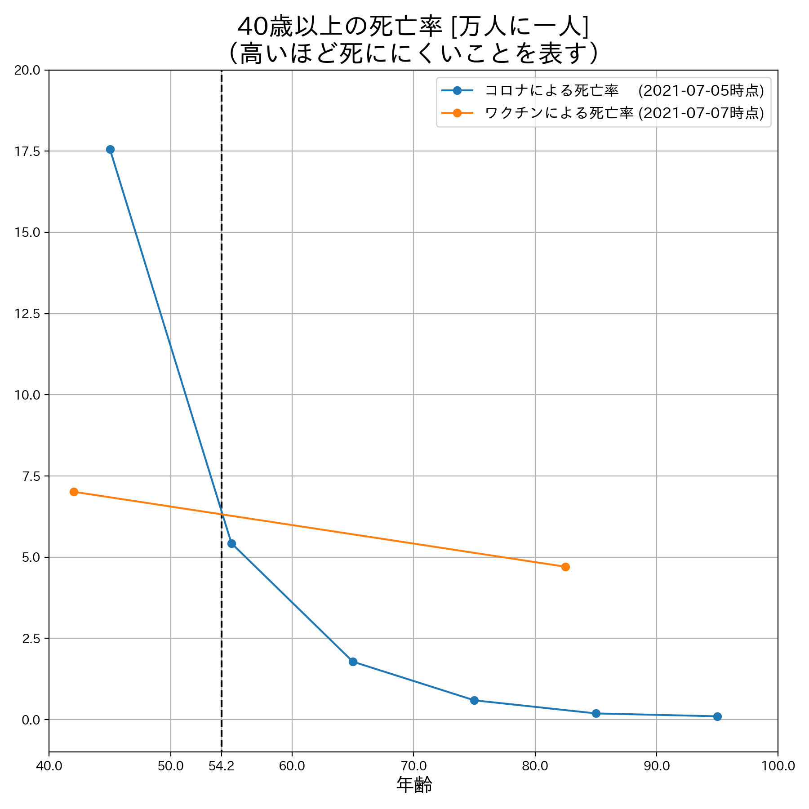

# covid-vs-vaccine-mortality-japan

## Installation

```bash
pip install -r requirements.txt
```

## Usage

```bash
./plot.py [--all-age]
```

 

```
# Covid data table
   age  covid_death_male  covid_death_female  population_male  population_female  population  covid_death  covid_death_rate  1/covid_death_rate  1/covid_death_rate [10K]
0    5                 0                   0          4900000            4660000     9560000            0      0.000000e+00                 inf                       inf
1   15                 0                   0          5600000            5340000    10940000            0      0.000000e+00                 inf                       inf
2   25                 5                   2          6580000            6160000    12740000            7      5.494505e-07        1.820000e+06                182.000000
3   35                19                   8          7040000            6790000    13830000           27      1.952278e-06        5.122222e+05                 51.222222
4   45                75                  27          9050000            8860000    17910000          102      5.695142e-06        1.755882e+05                 17.558824
5   55               251                  58          8410000            8370000    16780000          309      1.841478e-05        5.430421e+04                  5.430421
6   65               670                 190          7500000            7840000    15340000          860      5.606258e-05        1.783721e+04                  1.783721
7   75              1915                 851          7590000            8850000    16440000         2766      1.682482e-04        5.943601e+03                  0.594360
8   85              2720                2168          3680000            5680000     9360000         4888      5.222222e-04        1.914894e+03                  0.191489
9   95               914                1590           660000            1910000     2570000         2504      9.743191e-04        1.026358e+03                  0.102636

# Vaccination data table
    age  vaccination  vaccine_death_male  vaccine_death_female  population  vaccine_death  vaccine_death_rate  1/vaccine_death_rate  1/vaccine_death_rate [10K]
0  82.5     24614681                 258                   265    36340000            523            0.000021          47064.399618                    4.706440
1  42.0      2665544                  18                    20    89130000             38            0.000014          70145.894737                    7.014589
```


## Reference

- 日本人口(2021-06): https://www.stat.go.jp/data/jinsui/pdf/202106.pdf
- コロナによる年齢別死亡者数(2021-07-05): http://www.ipss.go.jp/projects/j/Choju/covid19/
- ワクチンによる死亡者数(2021-07-07): https://www.mhlw.go.jp/content/10601000/000802338.pdf
- ワクチン接種者数(2021-07-07): https://cio.go.jp/c19vaccine_opendata
