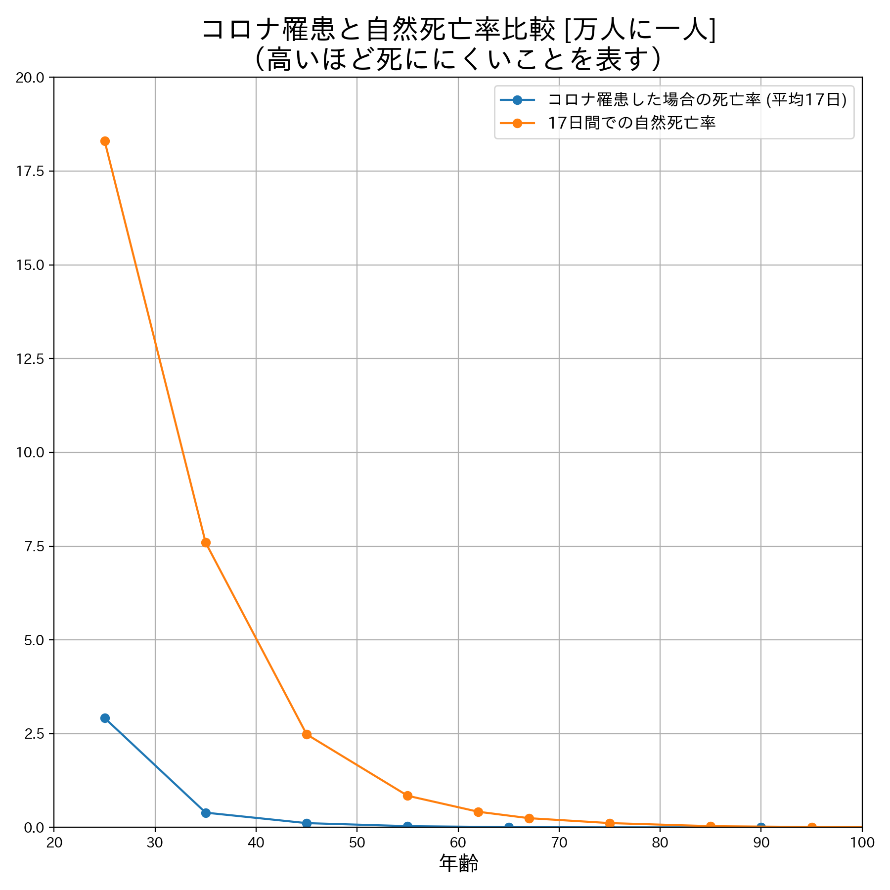
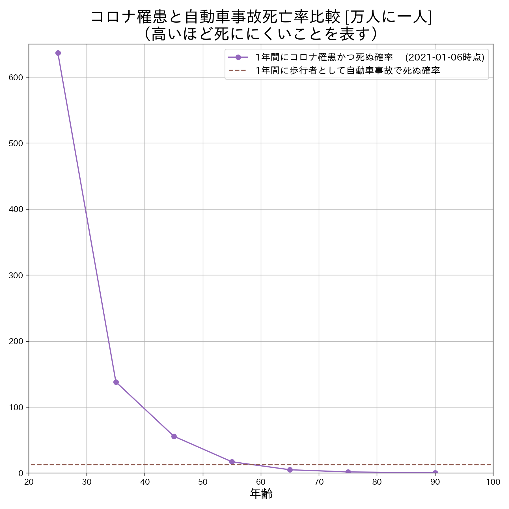

# コロナ罹患とワクチン接種の死亡率比較

レポート: https://covid-vs-vaccine-mortality-japan.wkentaro.com/

## Installation

```bash
pip install -r requirements.txt
```

## Usage

```bash
./plot_covid_vs_baseline_mortality.py
./plot_vaccine_vs_baseline_mortality.py
./plot_covid_vs_car_mortality.py
```

 



## Reference

- 日本人口(2021-06): https://www.stat.go.jp/data/jinsui/pdf/202106.pdf
- コロナによる年齢別死亡者数(2021-07-05): http://www.ipss.go.jp/projects/j/Choju/covid19/
- ワクチンによる死亡者数(2021-07-07): https://www.mhlw.go.jp/content/10601000/000802338.pdf
- ワクチン接種者数(2021-07-07): https://cio.go.jp/c19vaccine_opendata
